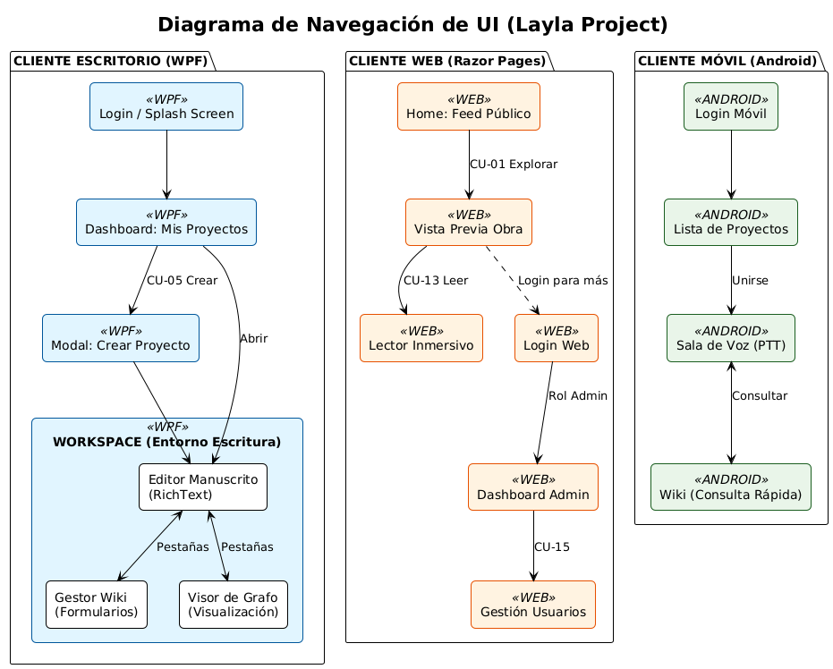
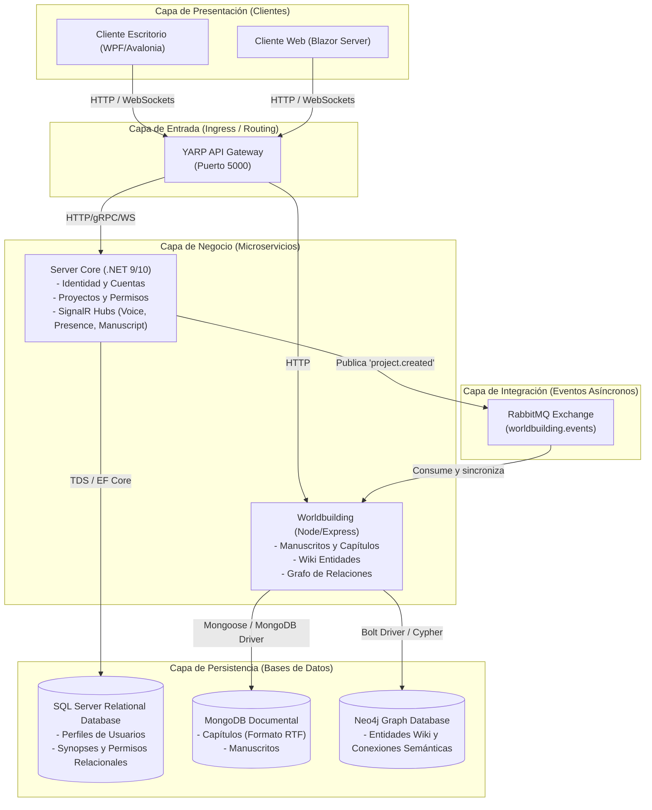
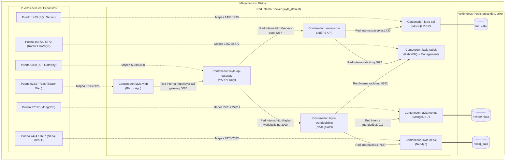

# Layla

Real-time collaborative creative-writing and worldbuilding platform. Multiple authors can co-write novels, manage wiki entries, visualize narrative graphs, and communicate through a voice session — all in real time.

---

# Use Cases
| ID    | Name                      | Actor           | Backend       | Status |
|-------|---------------------------|-----------------|---------------|--------|
| CU-01 | Browse public catalog     | Anyone          | server-core   | ✅ |
| CU-02 | Preview project synopsis  | Anyone          | server-core   | ✅ |
| CU-03 | Login / Register          | User            | server-core   | ✅ |
| CU-04 | Manage profile            | User            | server-core   | ✅ |
| CU-05 | Create project            | Writer          | server-core   | ✅ |
| CU-06 | Manage collaborators      | Writer (OWNER)  | server-core   | ✅ |
| CU-07 | Configure privacy         | Writer (OWNER)  | server-core   | ✅ |
| CU-08 | Edit manuscript           | Editor / Writer | worldbuilding | ✅ |
| CU-09 | Manage wiki (nodes)       | Editor / Writer | worldbuilding | ✅ |
| CU-10 | Visualize narrative graph | Reader / Editor | worldbuilding | ✅ |
| CU-11 | Voice session (speak)     | Writer          | server-core   | ✅ |
| CU-12 | Join as listener          | Reader          | server-core   | ✅ |
| CU-13 | Read full story           | Reader          | worldbuilding | ❌ |
| CU-14 | System reports            | Admin           | server-core   | ❌ |
| CU-15 | Manage users (ban/roles)  | Admin           | server-core   | ✅ |

✅ Implemented · 🔧 Partial · ❌ Not started

## Available navigation on each client


---

# Services and components description

## General architecture (Logical Component Flow)


## Physical Deployment Architecture (Docker Infrastructure)
Este diagrama detalla la infraestructura física montada mediante Docker Compose, incluyendo la red virtual `layla_default`, el mapeo de puertos y los volúmenes persistentes:



## Services
| Service                | Tech                | Ports (Internal / External) | Databases      | Purpose |
|------------------------|---------------------|------------------------|----------------|---------|
| `layla-api-gateway`    | .NET 9 + YARP Reverse Proxy | `5000` (HTTP)          | —              | Unified entry point, request routing, WebSockets & gRPC |
| `server-core`          | ASP.NET Core 10     | `5287` (HTTP) / `5288` (HTTPS) | SQL Server     | Auth, users, projects, roles, SignalR hubs |
| `server-worldbuilding` | Node.js + Express   | `3000` (HTTP) / `3001` (HTTPS) | MongoDB, Neo4j | Manuscripts, chapters, wiki, narrative graph |

## Clients
| Client  | Tech | Role |
|---------|------|------|
| Desktop | WPF .NET 9 | Main writing workspace — editor, wiki, graph, voice |
| Web     | Blazor .NET 9 | Public reader + admin panel (`5233` HTTP / `7126` HTTPS) |
| Android | Kotlin + Compose | Mobile companion — project list, voice PTT, wiki reference |

---

## API & Gateway Documentation

All endpoints and hubs are unified through the **API Gateway** running on port `5000`:

| Service | Swagger URL |
|---------|-----|
| `server-core` (direct)            | `https://localhost:5288/swagger` |
| `server-worldbuilding` (direct)   | `http://localhost:3000/api-docs` |
| **API Gateway** (unified)         | `http://localhost:5000/` |

---

## Project Roles
| Role     | Permissions |
|----------|-------------|
| `OWNER`  | Full control — update, delete, manage collaborators |
| `EDITOR` | Read + write manuscripts and wiki |
| `READER` | Read-only access |

---

## API Reference (Through Gateway — `http://localhost:5000`)

### 1. Identity & Projects (`server-core` endpoints)
#### Authentication & Users
* `POST /api/tokens` — Login (returns JWT valid for 24h)
* `POST /api/users` — Register new user
* `GET /api/users/{id}` — Get user by ID
* `POST /api/users/{id}/ban` — Ban user (Admin only)

#### Project Management
* `POST /api/projects` — Create project (caller becomes OWNER)
* `GET /api/projects` — List caller's projects
* `GET /api/projects/public` — List public catalog
* `POST /api/projects/{id}/collaborators` — Invite collaborator

#### Real-time Hubs (SignalR via Gateway WebSockets)
* `/hubs/voice` — Push-to-talk voice streaming
* `/hubs/presence` — Active user presence tracking
* `/hubs/manuscript` — Chapter collaboration and version synchronization

### 2. Worldbuilding (`server-worldbuilding` endpoints)
#### Manuscripts & Chapters
* `GET /api/manuscripts/{projectId}` — List manuscripts
* `POST /api/manuscripts/{projectId}` — Create manuscript
* `POST /api/manuscripts/{projectId}/{manuscriptId}/chapters` — Create chapter
* `GET /api/manuscripts/{projectId}/{manuscriptId}/chapters/{chapterId}` — Get chapter content
* `PUT /api/manuscripts/{projectId}/{manuscriptId}/chapters/{chapterId}` — Update chapter (LWW)

#### Wiki & Narrative Graph
* `GET /api/wiki/{projectId}` — List wiki entries
* `POST /api/wiki/{projectId}` — Create entry
* `GET /api/graph/{projectId}` — Get narrative graph (nodes + edges)
* `POST /api/graph/{projectId}/relationships` — Connect wiki entities

---

## Error Handling
All services use the typed `ErrorCode` enum (`Layla.Core/Common/ErrorCode.cs`) instead of magic strings. Controllers map errors to HTTP status codes automatically via `RespondWithError(ErrorCode?)`.

| ErrorCode Category | HTTP Status | Examples |
|--------------------|-------------|----------|
| Validation / Input | 400         | `InvalidInput` |
| Authentication     | 401         | `InvalidCredentials`, `SessionExpired` |
| Authorization      | 403         | `Forbidden` |
| Not found          | 404         | `ProjectNotFound`, `UserNotFound` |
| Conflict           | 409         | `DuplicateEmail` |
| Server errors      | 500         | `InternalError` |

---

# Setup

## Prerequisites
- **Docker Desktop** (highly recommended)
- **.NET 9 / 10 SDKs**
- **Node.js 22 / 24 + pnpm 10**

---

## Running the Application

### 1. Docker Environment (Recommended)
This compiles all images, configures healthchecks, and mounts the unified networks:
```bash
# 1. Copy the environment variables template
cp src/.env.example src/.env

# 2. Start the environment
cd src/
docker compose up -d --build
```
Once healthy, services expose:
* Unified API Gateway: `http://localhost:5000`
* SQL Server: `localhost:1433`
* MongoDB: `localhost:27017`
* Neo4j browser: `http://localhost:7474`
* RabbitMQ dashboard: `http://localhost:15672`

### 2. Local Development (Consoles with Live Reload)
We provide two unified dev runners in the root directory that start the API servers and clients in parallel without Docker requirements:

#### Windows (PowerShell)
```powershell
# Run backend APIs only
.\dev.ps1

# Run backend APIs + Blazor Web Client
.\dev.ps1 -Client web

# Run backend APIs + WPF Desktop Client
.\dev.ps1 -Client desktop
```

#### Linux / macOS (Bash)
```bash
chmod +x dev.sh

# Run backend APIs only
./dev.sh

# Run backend APIs + Blazor Web Client
./dev.sh --client web

# Run backend APIs + WPF Desktop Client
./dev.sh -c desktop
```

---

## Environment Variables Configuration

Copy `src/.env.example` to `src/.env` and adjust the variables. The microservices rely on the following variables:
* `WORLDBUILDING_ALLOWED_ORIGINS`: Comma-separated CORS origins containing localhost URLs (including `https://localhost:7126` and `http://localhost:5233` for the Blazor app, and `http://localhost:5000` for the Gateway).
* `JWT_SECRET` / `JWT_SECRET_REFRESH`: Cifrado HS512 (mínimo 32 caracteres).
* `SQL_PASSWORD` / `MONGO_INITDB_ROOT_PASSWORD` / `NEO4J_PASSWORD`: Passwords de bases de datos.
* `RABBIT_USER` / `RABBIT_PASSWORD`: Credenciales de mensajería asíncrona.
